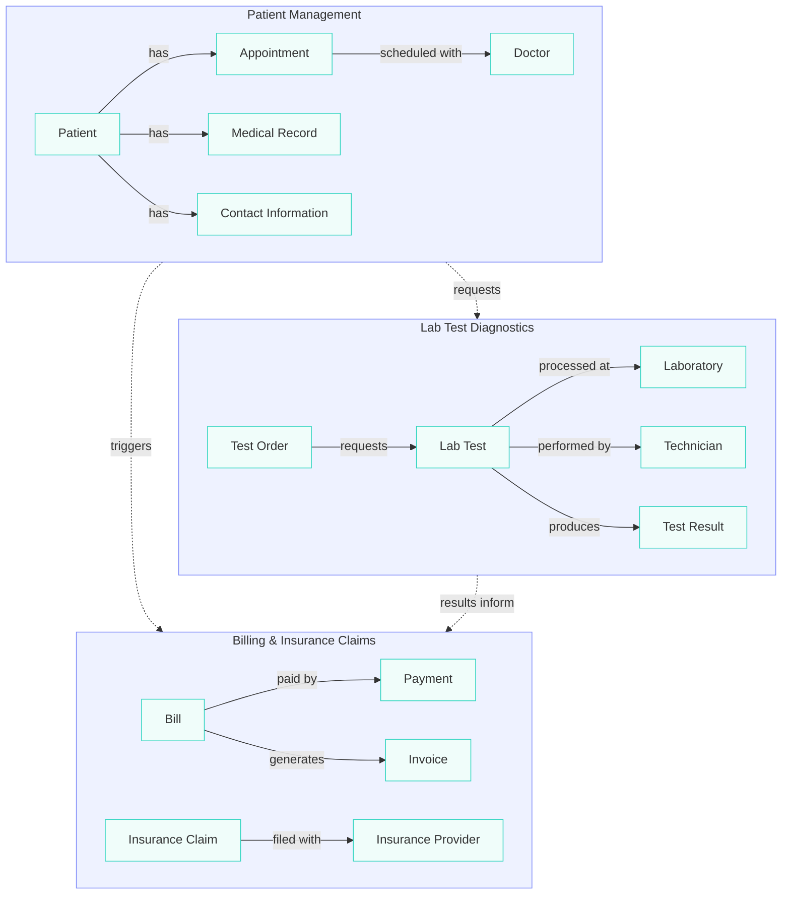

# My Project

## System Diagram

```mermaid

graph TD
  subgraph PatientManagement["Patient Management"]
    Patient["Patient"]
    Appointment["Appointment"]
    Doctor["Doctor"]
    MedicalRecord["Medical Record"]
    ContactInfo["Contact Information"]
    Patient -->|has| Appointment
    Patient -->|has| MedicalRecord
    Patient -->|has| ContactInfo
    Appointment -->|scheduled with| Doctor
  end

  subgraph BillingInsurance["Billing & Insurance Claims"]
    Bill["Bill"]
    Payment["Payment"]
    InsuranceClaim["Insurance Claim"]
    InsuranceProvider["Insurance Provider"]
    Invoice["Invoice"]
    Bill -->|paid by| Payment
    Bill -->|generates| Invoice
    InsuranceClaim -->|filed with| InsuranceProvider
  end

  subgraph LabDiagnostics["Lab Test Diagnostics"]
    LabTest["Lab Test"]
    TestOrder["Test Order"]
    TestResult["Test Result"]
    Laboratory["Laboratory"]
    Technician["Technician"]
    TestOrder -->|requests| LabTest
    LabTest -->|processed at| Laboratory
    LabTest -->|performed by| Technician
    LabTest -->|produces| TestResult
  end

  PatientManagement -.->|triggers| BillingInsurance
  PatientManagement -.->|requests| LabDiagnostics
  LabDiagnostics -.->|results inform| BillingInsurance

  classDef contextBox stroke:#818cf8,fill:#eef2ff
  classDef entity stroke:#2dd4bf,fill:#f0fdfa
  classDef relationship stroke:#a78bfa,fill:#f5f3ff
  
  class PatientManagement,BillingInsurance,LabDiagnostics contextBox
  class Patient,Appointment,Doctor,MedicalRecord,ContactInfo,Bill,Payment,InsuranceClaim,InsuranceProvider,Invoice,LabTest,TestOrder,TestResult,Laboratory,Technician entity
```
